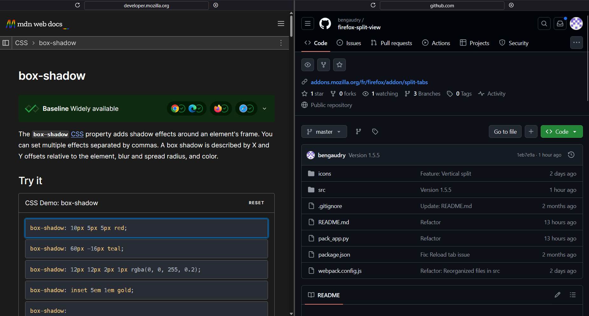
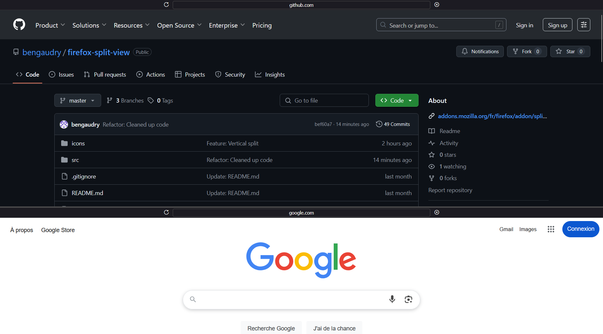

# Firefox Split Tabs

Split Tabs is a powerful Firefox extension that allows you to display and manage two websites simultaneously in a customizable split-view interface.

[](https://addons.mozilla.org/firefox/addon/split-tabs/)
[](https://opensource.org/licenses/Apache-2.0)

## Preview

You can split your tabs either vertically or horizontally, making it easier to multitask and compare content side by side.

Horizontal split example:



Vertical split example:



## Features

- **Split view**: View two tabs side-by-side or stacked.
- **Resizable**: Easily adjust the size of each pane.
- **Seamless integration**: Works directly within your Firefox browser.
- **Customizable**: Adjustable settings to fit your workflow.

## Getting started

### Installation

You can install the official version from the [Firefox Add-ons Marketplace](https://addons.mozilla.org/firefox/addon/split-tabs/).

### Manual installation for developers

1. **Clone the repository**:

   ```sh
   git clone https://github.com/YOUR_USERNAME/split-tabs.git
   cd split-tabs
   ```

2. **Install dependencies**:
   This project requires both [Node.js](https://nodejs.org/en) (for frontend tools) and [Python](https://www.python.org/) (for build scripts).

   ```sh
   # Install Node dependencies
   npm install

   # Setup Python environment
   python -m venv venv
   source venv/bin/activate  # On Windows: venv\Scripts\activate
   pip install -r requirements.txt
   ```

## Development

We use modern tooling to ensure high code quality and a consistent coding style.

### Formatting and linting

- **Frontend**: We use [Prettier](https://prettier.io/) for JavaScript, TypeScript, HTML, CSS, and JSON.
- **Python**: We use [Ruff](https://astral.sh/ruff) for fast linting and formatting.

#### Available scripts

- `npm run format`: Automatically format all files in the project.
- `npm run lint`: Check the project for style and linting violations.

> [!TIP]
> **Husky** git hooks are automatically installed. Every time you commit, [lint-staged](https://github.com/lint-staged/lint-staged) will ensure your changes are formatted and linted correctly.

### Project structure

- `src/`: Core extension logic and assets.
- `icons/`: Extension icons for various states.
- `pack_app.py`: Main build and packaging script.
- `webpack.config.js`: Webpack configuration for bundling TypeScript/JavaScript.

## Building and debugging

### Development build

To build the extension for local testing:

```sh
python pack_app.py
```

This script will:

1. Run Webpack to bundle assets.
2. Prepare a `build/` directory.
3. Generate an `extension.zip` file.
4. Automatically open `about:debugging` in Firefox for you to load the temporary addon.

### Production build

To generate a versioned package for the Firefox Add-ons Marketplace:

```sh
python pack_app.py -p
```

## Versions handling

Versions are managed in `src/manifest.json` following the `x.y.z` format:

- `x`: Major version.
- `y`: Minor version (new features).
- `z`: Patch version (bug fixes).

## License

This project is licensed under the Apache License 2.0 - see the [LICENSE](LICENSE) file for details.
